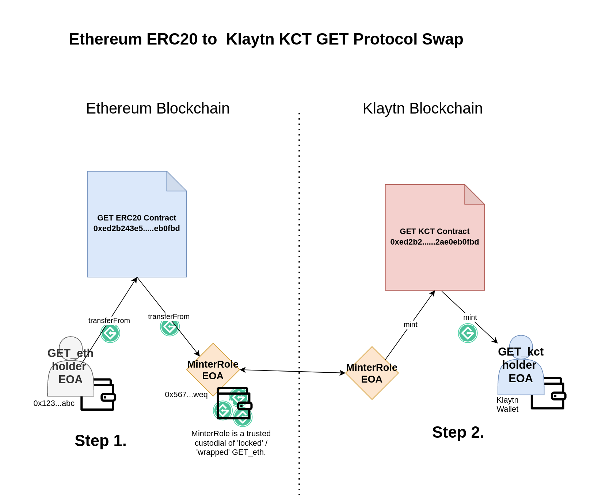

# GET Protocol Klaytn Swap Contracts
This repository contain the contracts that will facilitate the partial tokenswapping of the Guaranteed Entrance Token (issued by the GET Protocol) from the Ethereum Blockchain to the Klaytn Blockchain.

###  Klaytn x GET - Blockchain Integration
The GET Protocol is an internationally operating ticketing protocol. It's native token, the Guaranteed Entrance Token, is the fuel required for ticketing operations. To be included in the global smart ticketing ledger, a certain amount of GET is required. The protocols tools are blockchain agnostic. The client integrating the GET Protocols toolset (generally ticketing companies) can decide what blockchain is used to register and settle their business. For all ticketing in Korea, the GET Protocol will use the Klaytn blockchain as blockchain layer. To enable the usage of the GET Protocol tools a wrapped/swapped version of GET on the Klaytn blockchain is required. 

The contracts in this repostitory serve the purpose of issuing GET on the Klaytn blockcahin. The diagram below shows this process in 2 simple steps.

---

**Step 1. Depositing GET with a Minter (EOA -> EOA)**

User send their ERC20 GET (issued on Ethereum) to the address specified by the MinterRole. This entity is likel a centralized exchanger. The user, notifies this exchanger (or equivalent) of their public key hash (wallet address) on  the Klaytn blockchain.

**Step 2. Minting GET_kct on the Klaytn blockchain (Contract -> EOA)**

The minter will use the GET_kct's swap contracts mint function to issue new GET_kct on the Klaytn blockchain. This newly minted GET_kct will be sent to the users wallet address on the Klaytn blockchain.

---

## Completed Security Audits
 [Audit report of crowdsale contract by Matthew Di Ferrante.](https://github.com/mattdf/audits/tree/master/guts)   
[Audit report of finalized ERC20 GET contract by Slowmist](https://github.com/kasper-keunen/GET_Protocol_Audit_Swap/blob/main/audit_reports/Smart%20Contract%20Security%20Audit%20-%20GET.pdf)  

---

## Swap contracts deployed on Klaytn Blockchain
[Testnet Swap Contract 0xed2b243e561f4d9f2b708d2b2b83cf2ae0eb0fbd:](https://baobab.scope.klaytn.com/account/0xed2b243e561f4d9f2b708d2b2b83cf2ae0eb0fbd)

[Mainnet Swap Contract 0xed2b243e561f4d9f2b708d2b2b83cf2ae0eb0fbd:](https://scope.klaytn.com/account/0xed2b243e561f4d9f2b708d2b2b83cf2ae0eb0fbd?tabId=internalTx)

*Contract verification pending*

Deployer: 0x1ec51aab59bab529f4ae2b78cebd9808a6ecdfaa 

Owner: 0x1ec51aab59bab529f4ae2b78cebd9808a6ecdfaa

Minter: 0x1ec51aab59bab529f4ae2b78cebd9808a6ecdfaa

---

## Klaytn GET partial/continous swap details

#### About GET_eth 
GET_eth was minted in 2017 after a public crowdsale. GET is a regular ERC20 contract with a capped supply.

#### About GET_kct
*GET_kct* is  the representation of GET on the Klaytn blockchain (essentially 'wrapped GET' - managed in a custodial & centralized manner). The process of receiving GET_eth custodially and then minting an equal amount of GET_kct is done 'manually' by an address that has been granted 'minter rights' to the GET_kct contract (called MinterRole). 

#### About the Klaytn Blockchain
Klaytn is an 100% EVM compatible blockchain. For more information about Klaytn refer to the following documentation: https://docs.klaytn.com/klaytn. 

##### Compiler & Deployment
The Klaytn EVM compiler doesn't support the newest compiler versions of Solidity. Therefore contarcts in this repo will be used the tried and tested 0.5.0 version of Solidity.  

---

## Overview contracts 
The majority of the contracts used are sourced from the [V.3.0 version of the Open Zeppeling contracts.](https://github.com/OpenZeppelin/openzeppelin-contracts/blob/v2.3.0/contracts/). The only contracts that have some edited code contain some minor changes is MinterRole.sol. 

#### Ownable.sol
Sourced from Open ZeppelinV2.3.0: https://github.com/OpenZeppelin/openzeppelin-contracts/blob/v2.3.0/contracts/ownership/Ownable.sol. No changes made to the code. This contract module provides a basic access control mechanism, where there is an account (an owner) that can be granted exclusive access to specific functions.

#### MinterRole.sol
Sourced from Open ZeppelinV2.3.0: https://github.com/OpenZeppelin/openzeppelin-contracts/blob/v2.3.0/contracts/access/roles/MinterRole.sol. Minor changes where made (only allowing the owner to add minters using Ownable.sol). 

#### GET_kct.sol
Standard contract inheriting contracts and constructing an ERC20 asset from it. This contract is used to deploy the GET_kct token. All the values (name, ticker & decimals) are hardcoded. 

#### Roles.sol
Standard Open Zeppeling contract. Sourced from Open ZeppelinV2.3.0: https://github.com/OpenZeppelin/openzeppelin-contracts/blob/v2.3.0/contracts/access/Roles.sol. No changes have been made to this code. The roles contract is used to manage the storage of the onlyMinter modifier. Allowing the owner to manage what addresses/contracts are allowed to mint kyc_GET tokens on the Klaytn blockchain. 

#### SafeMath.sol
Standard Open Zeppeling contract. Sourced from Open ZeppelinV2.3.0: https://github.com/OpenZeppelin/openzeppelin-contracts/blob/v2.3.0/contracts/math/SafeMath.sol. No changes have been made to this code. The SafeMath contract is used to handle calculation in a manner that prevents overflow errors and other unwanted behviour.

#### ERC20Detailed.sol
Standard Open Zeppeling contract. Sourced from Open ZeppelinV2.3.0: https://github.com/OpenZeppelin/openzeppelin-contracts/blob/v2.3.0/contracts/token/ERC20/ERC20Detailed.sol. No changes have been made to this code. The ERC20Detailed contract allows for the addition of metadata to the ERC20 standard. 

#### ERC20.sol 
Standard Open Zeppeling contract. Sourced from Open ZeppelinV2.3.0: https://github.com/OpenZeppelin/openzeppelin-contracts/blob/v2.3.0/contracts/token/ERC20/ERC20.sol No changes have been made to this code. The ERC20 standard provides a standarization for tokenization. This contract describes all the standard features of the ERC20 standard as is well known in the space.

----

## Roles 
The system has two roles. An Owner address (there can only be 1 owner/admin address at any time). And a MinterRole (there can be an infinite amount of minters). 

#### 1. Owner role
This is the admin/super user. Rights include:
- Adding minters
- Removing minters 
- Transferring ownership

#### 2. Minter role
Minters are able to mint new GET_kct tokens. Their rights include:
- Minting GET_kct
- Revoking their minter-status

## Security Audit Inquiry
To ensure the safety of the partial and continous token swap between GET_eth and GET_kct we would like to have a security audit performed. This audit mainly needs to focus on the "Minterrole.sol" contract. Beyond the management of the minters, there is to audit in these contracts beyond the obvious. 

#### GET Ethereum Mainnet
[GET_eth Contract Etherscan 0x8a854288a5976036a725879164ca3e91d30c6a1b](https://etherscan.io/token/0x8a854288a5976036a725879164ca3e91d30c6a1b).   

#### GET Klaytn Mainnet
KCT token of GET on the Klaytn blockchain. GET_kcy is a fungible token (KIP-7 standard). [GET_kct on Klaytn Mainnet 0xed2b243e561f4d9f2b708d2b2b83cf2ae0eb0fbd](https://scope.klaytn.com/account/0xed2b243e561f4d9f2b708d2b2b83cf2ae0eb0fbd?tabId=internalTx) 

